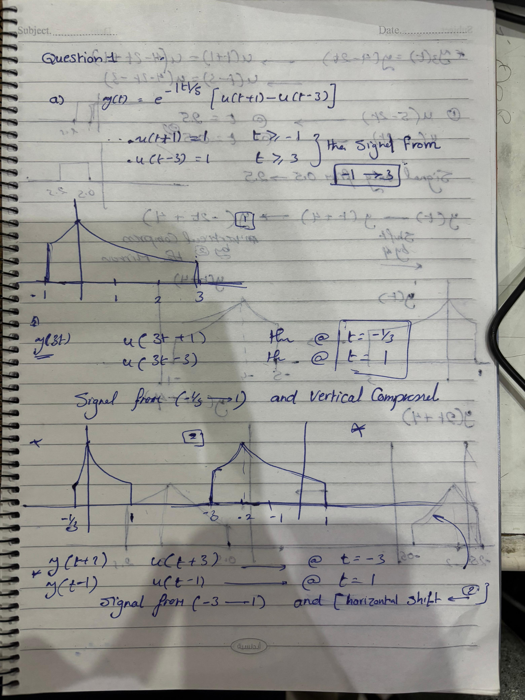
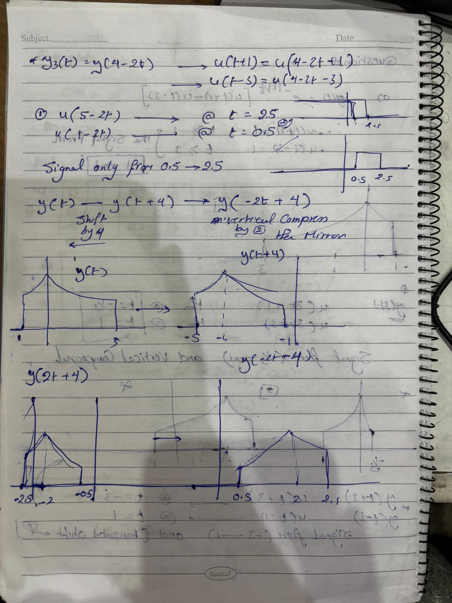
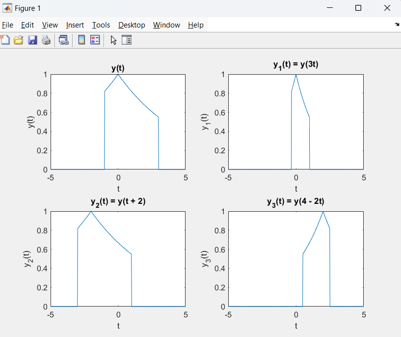

# Signals and Systems Final Project Report

> **Student 1**: Yusuf Ahmad Hamdy Borham  **ID**: 8676

> **Student 2**: Habiba Marwan ElKhmary **ID**: 8855

## Part I (Handwritten and MATLAB)

### Question1 

#### a) Handwritten Solution




#### b) MATLAB Solution

```matlab
t = -5:0.01:5;  

y = exp(-abs(t)/5) .* (heaviside(t + 1) - heaviside(t - 3));

y1 = exp(-abs(3*t)/5) .* (heaviside(3*t + 1) - heaviside(3*t - 3));   
y2 = exp(-abs(t + 2)/5) .* (heaviside(t + 3) - heaviside(t - 1));    
y3 = exp(-abs(4 - 2*t)/5) .* (heaviside(4 - 2*t + 1) - heaviside(4 - 2*t - 3)); 


figure;
subplot(2, 2, 1);
plot(t, y);
title('y(t)');
xlabel('t');
ylabel('y(t)');

subplot(2, 2, 2);
plot(t, y1);
title('y_1(t) = y(3t)');
xlabel('t');
ylabel('y_1(t)');

subplot(2, 2, 3);
plot(t, y2);
title('y_2(t) = y(t + 2)');
xlabel('t');
ylabel('y_2(t)');

subplot(2, 2, 4);
plot(t, y3);
title('y_3(t) = y(4 - 2t)');
xlabel('t');
ylabel('y_3(t)');
```


### Question2

#### a) Handwritten Solution

#### b) MATLAB Solution

```matlab
```
### Question3 

#### a) Handwritten Solution

#### b) MATLAB Solution

``` matlab
```

