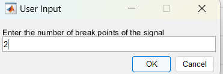
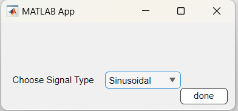

# Signals and Systems Final Project Report

> **Student 1**: Yusuf Ahmad Hamdy Borham  **ID**: 8676

> **Student 2**: Habiba Marwan ElKhmary **ID**: 8855

## Part I (Handwritten and MATLAB)

### Question1 

#### a) Handwritten Solution


---


---

#### b) MATLAB Solution

```matlab
t = -5:0.01:5;  

y = exp(-abs(t)/5) .* (heaviside(t + 1) - heaviside(t - 3));

y1 = exp(-abs(3*t)/5) .* (heaviside(3*t + 1) - heaviside(3*t - 3));   
y2 = exp(-abs(t + 2)/5) .* (heaviside(t + 3) - heaviside(t - 1));    
y3 = exp(-abs(4 - 2*t)/5) .* (heaviside(4 - 2*t + 1) - heaviside(4 - 2*t - 3)); 


figure;
subplot(2, 2, 1);
plot(t, y);
title('y(t)');
xlabel('t');
ylabel('y(t)');

subplot(2, 2, 2);
plot(t, y1);
title('y_1(t) = y(3t)');
xlabel('t');
ylabel('y_1(t)');

subplot(2, 2, 3);
plot(t, y2);
title('y_2(t) = y(t + 2)');
xlabel('t');
ylabel('y_2(t)');

subplot(2, 2, 4);
plot(t, y3);
title('y_3(t) = y(4 - 2t)');
xlabel('t');
ylabel('y_3(t)');
```


### Question2

#### a) Handwritten Solution


---


--- 

#### b) MATLAB Solution

```matlab

t = -0.01:1e-6:0.01;  
Ts = t(2) - t(1);     
Fs = 1/Ts;            

sinc_func = sin(pi * (10^3) .* t) ./ (pi * (10^3) .* t);   
sinc_func(isnan(sinc_func)) = 1;  

m_t = sinc_func .^ 2;


figure;
plot(t, m_t, 'LineWidth', 1.5);
title('Signal m(t) = sinc^2(10^{-3}t)');
xlabel('Time (s)');
ylabel('Amplitude');
grid on;

N = length(m_t);
M_f = abs(fftshift(fft(m_t, N))) * Ts;   
f = linspace(-Fs/2, Fs/2, N);           

figure;
plot(f, M_f, 'LineWidth', 1.5);
title('Magnitude Spectrum |M(\omega)| of m(t)');
xlabel('Frequency (Hz)');
ylabel('Magnitude');
grid on;

fc = 1e5;   
carrier = cos(2 * pi * fc * t);  
r_t = m_t .* carrier;

figure;
plot(t, r_t, 'LineWidth', 1.5);
title('Modulated Signal r(t) = m(t)cos(2\pi10^5t)');
xlabel('Time (s)');
ylabel('Amplitude');
grid on;

R_f = abs(fftshift(fft(r_t, N))) * Ts;

figure;
plot(f, R_f, 'LineWidth', 1.5);
title('Magnitude Spectrum |R(\omega)| of r(t)');
xlabel('Frequency (Hz)');
ylabel('Magnitude');
grid on;

disp('The spectrum R(\omega) is a shifted version of M(\omega) to +/- fc.');
disp('This is due to the modulation property of the Fourier Transform.');

```
<p align="center">
  
  
</p>

<p align="center">
  
  
</p>

### Question3 

#### a) Handwritten Solution


#### b) MATLAB Solution

``` matlab
T = pi;                     
omega0 = 2;                 
k = -10:10;                 
 
ck = zeros(size(k));         

for i = 1:length(k)
    k_val = k(i);
    exponent = 1 + 1j * omega0 * k_val;  
    numerator = exp(-exponent * T) - 1; 
    ck(i) = (1 / T) * (numerator / -exponent);
end

ck_magnitude = abs(ck);
ck_phase = angle(ck);

figure;

subplot(2,1,1);
stem(k, ck_magnitude, 'filled', 'r');
title('Magnitude of Fourier Series Coefficients |c_k|');
xlabel('k');
ylabel('|c_k|');
grid on;

subplot(2,1,2);
stem(k, ck_phase, 'filled', 'b');
title('Phase of Fourier Series Coefficients \angle c_k');
xlabel('k');
ylabel('Phase (radians)');
grid on;

```


## Part II (MATLAB) Signal Gnerator and Analysis

1) Main APP 
``` matlab
classdef projectApp < matlab.apps.AppBase

    % Properties that correspond to app components
    properties (Access = public)
        UIFigure    matlab.ui.Figure
        Panel       matlab.ui.container.Panel
        editButton  matlab.ui.control.Button
        DrawButton  matlab.ui.control.Button
        UIAxes      matlab.ui.control.UIAxes
    end

    
    methods (Access = private)
        function DCsignal(app,startTime,endTime,Amp,samplingFreq)
            t = linspace(startTime , endTime , samplingFreq*(endTime-startTime)) ;
            y = Amp*ones(1,samplingFreq*(endTime-startTime)) ;
            plot(app.UIAxes,t,y,"b") ;
            hold(app.UIAxes ,'on') ;
            oldvect = evalin('base','SignalVector') ;
            newVect = [oldvect , y];
            assignin('base',"SignalVector",newVect);
            % xlim(app.UIAxes, [startTime endTime]);
        end
        function Rampsignal(app,startTime,endTime,Amp,c,samplingFreq)
            t = linspace(startTime , endTime , samplingFreq*(endTime-startTime)) ;
            y = Amp*t + c ;
            plot(app.UIAxes,t,y,"b") ;
            hold(app.UIAxes ,'on') ;
            oldvect = evalin('base','SignalVector') ;
            newVect = [oldvect , y];
            assignin('base',"SignalVector",newVect);
            % xlim(app.UIAxes, [startTime endTime]);
        end
        function Exposignal(app,startTime,endTime,Amp,pow,samplingFreq)
            t = linspace(startTime , endTime , samplingFreq*(endTime-startTime)) ;
            y = Amp*exp(pow*t) ;
            plot(app.UIAxes,t,y,"b") ;
            hold(app.UIAxes ,'on') ;
            oldvect = evalin('base','SignalVector') ;
            newVect = [oldvect , y];
            assignin('base',"SignalVector",newVect);
            % xlim(app.UIAxes, [startTime endTime]);
        end
        function sinsignal(app,startTime,endTime,Amp,freq,phase,samplingFreq)
            t = linspace(startTime , endTime , samplingFreq*(endTime-startTime)) ;
            y = Amp*cos(freq*t+phase);
            plot(app.UIAxes,t,y,"b") ;
            hold(app.UIAxes ,'on') ;
            oldvect = evalin('base','SignalVector') ;
            newVect = [oldvect , y];
            assignin('base',"SignalVector",newVect);
            % xlim(app.UIAxes, [startTime endTime]);
        end
        function polysignal(app,startTime,endTime,Amp,pow,c,samplingFreq)
            t = linspace(startTime , endTime , samplingFreq*(endTime-startTime)) ;
            y = Amp*t.^pow + c;
            plot(app.UIAxes,t,y,"b") ;
            hold(app.UIAxes ,'on') ;
            oldvect = evalin('base','SignalVector') ;
            newVect = [oldvect , y];
            assignin('base',"SignalVector",newVect);
            % xlim(app.UIAxes, [startTime endTime]);
        end
        
        function amplituideScale(app,amp)
            hold(app.UIAxes ,'off') ;
            oldvect = evalin('base','SignalVector') ;
            oldvect = amp*oldvect;

            oldvectTime = evalin('base','SignalVectorTime') ;
            plot(app.UIAxes,oldvectTime,oldvect,"r") ;
            
            assignin('base',"SignalVector",oldvect);
            assignin('base',"SignalVectorTime",oldvectTime);

            
        end
        function  timeShift(app,value)
            hold(app.UIAxes ,'off') ;
            oldvect = evalin('base','SignalVector') ;
            oldvectTime = evalin('base','SignalVectorTime') ;
            oldvectTime= oldvectTime+value;
           
            plot(app.UIAxes,oldvectTime,oldvect,"r") ;
            
            assignin('base',"SignalVector",oldvect);
            assignin('base',"SignalVectorTime",oldvectTime);

            
        end
          function  timeReversal(app)
            hold(app.UIAxes ,'off') ;
            oldvect = evalin('base','SignalVector') ;
            oldvectTime = evalin('base','SignalVectorTime') ;
            oldvectTime= -oldvectTime;
           
            plot(app.UIAxes,oldvectTime,oldvect,"r") ;
            
            assignin('base',"SignalVector",oldvect);
            assignin('base',"SignalVectorTime",oldvectTime);

            
          end
           function  compress(app,value)
            hold(app.UIAxes ,'off') ;
            oldvect = evalin('base','SignalVector') ;
            oldvectTime = evalin('base','SignalVectorTime') ;
            oldvectTime= value*oldvectTime;
           
            plot(app.UIAxes,oldvectTime,oldvect,"r") ;
            
            assignin('base',"SignalVector",oldvect);
            assignin('base',"SignalVectorTime",oldvectTime);

            
           end
           function  expand(app,value)
            hold(app.UIAxes ,'off') ;
            oldvect = evalin('base','SignalVector') ;
            oldvectTime = evalin('base','SignalVectorTime') ;
            oldvectTime= value*oldvectTime;
           
            plot(app.UIAxes,oldvectTime,oldvect,"r") ;
            
            assignin('base',"SignalVector",oldvect);
            assignin('base',"SignalVectorTime",oldvectTime);

            
        end
    end
    

    % Callbacks that handle component events
    methods (Access = private)

        % Button pushed function: DrawButton
        function DrawButtonPushed(app, event)
            dlgtitle = 'User Input';
            dims = [1 50]; % 1 line, 50 characters width
            definput = {''}; % Default input value

            prompt = {'Enter the sampling frequency of the signal'};
            sampling_freq = str2double(inputdlg(prompt, dlgtitle, dims, definput));

            prompt = {'Enter the start time of the signal'};
            start_time = str2double(inputdlg(prompt, dlgtitle, dims, definput));

            prompt = {'Enter the end time of the signal'};
            end_time = str2double(inputdlg(prompt, dlgtitle, dims, definput));

            allTime = linspace(start_time,end_time,(end_time-start_time)*sampling_freq)
            assignin('base',"SignalVectorTime",allTime);

            prompt = {'Enter the number of break points of the signal'};
            break_points_number = str2double(inputdlg(prompt, dlgtitle, dims, definput));

            prompt = {'Enter the break points of the signal (comma separated)'};
            break_points = inputdlg(prompt, dlgtitle, dims, definput);
            break_points_ints = str2double(split(break_points, ','))% Replace commas with space
            break_points_ints = [start_time break_points_ints' end_time]

            assignin('base',"SignalVector",0);
            
            counter = 1 ;

            while counter <= length(break_points_ints)-1 
                builder = buildingSignal();
                waitfor(builder) ;
                result = evalin('base','result') ;
                disp(result)
                
    
                if (strcmp(result,"DC"))
                    prompt = {'Enter the Amplitude'};
                    Amplitude = str2double(inputdlg(prompt, dlgtitle, dims, definput));
                    DCsignal(app,break_points_ints(counter) ,break_points_ints(counter+1),Amplitude,sampling_freq)
                elseif(strcmp(result,"Exponential"))
                    prompt = {'Enter the Amplitude'};
                    Amplitude = str2double(inputdlg(prompt, dlgtitle, dims, definput));
    
                    prompt = {'Enter the exponent'};
                    Exponent = str2double(inputdlg(prompt, dlgtitle, dims, definput));

                    Exposignal(app,break_points_ints(counter) ,break_points_ints(counter+1),Amplitude,Exponent,sampling_freq);
                elseif(strcmp(result,"Sinusoidal"))
                    prompt = {'Enter the Amplitude'};
                    Amplitude = str2double(inputdlg(prompt, dlgtitle, dims, definput));
    
                    prompt = {'Enter the frequency'};
                    frequency = str2double(inputdlg(prompt, dlgtitle, dims, definput));
    
                    prompt = {'Enter the phase'};                
                    phase = str2double(inputdlg(prompt, dlgtitle, dims, definput));

                    sinsignal(app,break_points_ints(counter) ,break_points_ints(counter+1),Amplitude,frequency,phase,sampling_freq)
                elseif(strcmp(result,"Ramp"))
                     prompt = {'Enter the Slope'};
                     Slope = str2double(inputdlg(prompt, dlgtitle, dims, definput));
    
                     prompt = {'Enter the intercept'};
                     intercept = str2double(inputdlg(prompt, dlgtitle, dims, definput));

                     Rampsignal(app,break_points_ints(counter) ,break_points_ints(counter+1),Slope ,intercept ,sampling_freq )
               elseif(strcmp(result,"Polynomial"))
                     prompt = {'Enter the power'};
                     power = str2double(inputdlg(prompt, dlgtitle, dims, definput));
    
                     prompt = {'Enter the intercept'};
                     intercept = str2double(inputdlg(prompt, dlgtitle, dims, definput));
    
                     prompt = {'Enter the Amplituide'};
                     Amplitude = str2double(inputdlg(prompt, dlgtitle, dims, definput));

                    polysignal(app,break_points_ints(counter) ,break_points_ints(counter+1),Amplitude,power,intercept,sampling_freq)
                end

            counter = counter + 1 ;
       
            end

        hold(app.UIAxes ,'off') ;
        oldvect = evalin('base','SignalVector') ;
        plot(app.UIAxes,allTime,oldvect(2:end),"r") ;
        assignin('base',"SignalVector",oldvect(2:end));


        end

        % Button pushed function: editButton
        function editButtonPushed(app, event)
            dlgtitle = 'User Input';
            dims = [1 50]; % 1 line, 50 characters width
            definput = {''}; % Default input value
            editWindow = editSignal();
            waitfor(editWindow);
            result = evalin('base','operation') ;
            disp(result);
            if(strcmp(result,"Amplituide Scaling"))
               prompt = {'Enter the Scale'};
               valueOfoperation = str2double(inputdlg(prompt, dlgtitle, dims, definput));
               amplituideScale(app,valueOfoperation);
            elseif(strcmp(result,"Time reversal"))
               timeReversal(app);
            elseif(strcmp(result,"Compression"))
                prompt = {'Enter the value'};
                valueOfoperation = str2double(inputdlg(prompt, dlgtitle, dims, definput));
            while valueOfoperation>1
              prompt = {'Enter value smaller than 1'};
              valueOfoperation = str2double(inputdlg(prompt, dlgtitle, dims, definput));
            end
             compress(app,valueOfoperation);
            elseif(strcmp(result,"Time shift"))
             prompt = {'Enter the value'};
            valueOfoperation = str2double(inputdlg(prompt, dlgtitle, dims, definput));
            timeShift(app,valueOfoperation);

            elseif(strcmp(result,"Expansion"))
             prompt = {'Enter the value'};
            valueOfoperation = str2double(inputdlg(prompt, dlgtitle, dims, definput));
            while valueOfoperation<1
            prompt = {'Enter value greater than 1'};
            valueOfoperation = str2double(inputdlg(prompt, dlgtitle, dims, definput));
            end
            expand(app,valueOfoperation);
            elseif(strcmp(result,"none"))
            end


        end
    end

    % Component initialization
    methods (Access = private)

        % Create UIFigure and components
        function createComponents(app)

            % Create UIFigure and hide until all components are created
            app.UIFigure = uifigure('Visible', 'off');
            app.UIFigure.Position = [100 100 640 480];
            app.UIFigure.Name = 'MATLAB App';

            % Create UIAxes
            app.UIAxes = uiaxes(app.UIFigure);
            title(app.UIAxes, 'Signal')
            xlabel(app.UIAxes, 'Time')
            ylabel(app.UIAxes, 'f(t)')
            zlabel(app.UIAxes, 'Z')
            app.UIAxes.XGrid = 'on';
            app.UIAxes.YGrid = 'on';
            app.UIAxes.Position = [16 169 589 274];

            % Create Panel
            app.Panel = uipanel(app.UIFigure);
            app.Panel.Title = 'Panel';
            app.Panel.Position = [16 42 150 85];

            % Create DrawButton
            app.DrawButton = uibutton(app.Panel, 'push');
            app.DrawButton.ButtonPushedFcn = createCallbackFcn(app, @DrawButtonPushed, true);
            app.DrawButton.Position = [15 38 100 22];
            app.DrawButton.Text = 'Draw';

            % Create editButton
            app.editButton = uibutton(app.Panel, 'push');
            app.editButton.ButtonPushedFcn = createCallbackFcn(app, @editButtonPushed, true);
            app.editButton.Position = [16 4 100 22];
            app.editButton.Text = 'edit';

            % Show the figure after all components are created
            app.UIFigure.Visible = 'on';
        end
    end

    % App creation and deletion
    methods (Access = public)

        % Construct app
        function app = projectApp

            % Create UIFigure and components
            createComponents(app)

            % Register the app with App Designer
            registerApp(app, app.UIFigure)

            if nargout == 0
                clear app
            end
        end

        % Code that executes before app deletion
        function delete(app)

            % Delete UIFigure when app is deleted
            delete(app.UIFigure)
        end
    end
end
```
2) Building Signal
``` matlab
classdef buildingSignal < matlab.apps.AppBase

    % Properties that correspond to app components
    properties (Access = public)
        UIFigure                       matlab.ui.Figure
        doneButton                     matlab.ui.control.Button
        ChooseSignalTypeDropDown       matlab.ui.control.DropDown
        ChooseSignalTypeDropDownLabel  matlab.ui.control.Label
    end

    
    

    % Callbacks that handle component events
    methods (Access = private)

        % Value changed function: ChooseSignalTypeDropDown
        function ChooseSignalTypeDropDownValueChanged(app, event)
           % Update the output value when the dropdown value changes
            value = app.ChooseSignalTypeDropDown.Value;
            assignin('base',"result",value)
            
        end

        % Button pushed function: doneButton
        function doneButtonPushed(app, event)

            delete(app);  % Close the window
        end
    end

    % Component initialization
    methods (Access = private)

        % Create UIFigure and components
        function createComponents(app)

            % Create UIFigure and hide until all components are created
            app.UIFigure = uifigure('Visible', 'off');
            app.UIFigure.Position = [100 100 308 115];
            app.UIFigure.Name = 'MATLAB App';

            % Create ChooseSignalTypeDropDownLabel
            app.ChooseSignalTypeDropDownLabel = uilabel(app.UIFigure);
            app.ChooseSignalTypeDropDownLabel.HorizontalAlignment = 'right';
            app.ChooseSignalTypeDropDownLabel.Position = [11 29 112 22];
            app.ChooseSignalTypeDropDownLabel.Text = 'Choose Signal Type';

            % Create ChooseSignalTypeDropDown
            app.ChooseSignalTypeDropDown = uidropdown(app.UIFigure);
            app.ChooseSignalTypeDropDown.Items = {'DC', 'Ramp', 'Polynomial', 'Exponential', 'Sinusoidal', 'choose'};
            app.ChooseSignalTypeDropDown.ValueChangedFcn = createCallbackFcn(app, @ChooseSignalTypeDropDownValueChanged, true);
            app.ChooseSignalTypeDropDown.Position = [138 29 100 22];
            app.ChooseSignalTypeDropDown.Value = 'choose';

            % Create doneButton
            app.doneButton = uibutton(app.UIFigure, 'push');
            app.doneButton.ButtonPushedFcn = createCallbackFcn(app, @doneButtonPushed, true);
            app.doneButton.Position = [237 8 62 22];
            app.doneButton.Text = 'done';

            % Show the figure after all components are created
            app.UIFigure.Visible = 'on';
        end
    end

    % App creation and deletion
    methods (Access = public)

        % Construct app
        function app = buildingSignal

            % Create UIFigure and components
            createComponents(app)

            % Register the app with App Designer
            registerApp(app, app.UIFigure)

            if nargout == 0
                clear app
            end
        end

        % Code that executes before app deletion
        function delete(app)

            % Delete UIFigure when app is deleted
            delete(app.UIFigure)
        end
    end
end
```

3) Edit Signal
``` matlab
classdef editSignal < matlab.apps.AppBase

    % Properties that correspond to app components
    properties (Access = public)
        UIFigure                    matlab.ui.Figure
        chooseasignalDropDown       matlab.ui.control.DropDown
        chooseasignalDropDownLabel  matlab.ui.control.Label
        DoneButton                  matlab.ui.control.Button
    end

    % Callbacks that handle component events
    methods (Access = private)

        % Button pushed function: DoneButton
        function DoneButtonPushed(app, event)
            delete(app);
        end

        % Value changed function: chooseasignalDropDown
        function chooseasignalDropDownValueChanged(app, event)
            value = app.chooseasignalDropDown.Value;
            assignin('base','operation',value);
        end
    end

    % Component initialization
    methods (Access = private)

        % Create UIFigure and components
        function createComponents(app)

            % Create UIFigure and hide until all components are created
            app.UIFigure = uifigure('Visible', 'off');
            app.UIFigure.Position = [100 100 263 167];
            app.UIFigure.Name = 'MATLAB App';

            % Create DoneButton
            app.DoneButton = uibutton(app.UIFigure, 'push');
            app.DoneButton.ButtonPushedFcn = createCallbackFcn(app, @DoneButtonPushed, true);
            app.DoneButton.Position = [149 15 100 22];
            app.DoneButton.Text = 'Done ';

            % Create chooseasignalDropDownLabel
            app.chooseasignalDropDownLabel = uilabel(app.UIFigure);
            app.chooseasignalDropDownLabel.HorizontalAlignment = 'right';
            app.chooseasignalDropDownLabel.Position = [33 73 88 22];
            app.chooseasignalDropDownLabel.Text = 'choose a signal';

            % Create chooseasignalDropDown
            app.chooseasignalDropDown = uidropdown(app.UIFigure);
            app.chooseasignalDropDown.Items = {'choose', 'Amplituide Scaling', 'Time shift', 'Time reversal', 'Compression', 'Expansion'};
            app.chooseasignalDropDown.ValueChangedFcn = createCallbackFcn(app, @chooseasignalDropDownValueChanged, true);
            app.chooseasignalDropDown.Position = [132 73 100 22];
            app.chooseasignalDropDown.Value = 'choose';

            % Show the figure after all components are created
            app.UIFigure.Visible = 'on';
        end
    end

    % App creation and deletion
    methods (Access = public)

        % Construct app
        function app = editSignal

            % Create UIFigure and components
            createComponents(app)

            % Register the app with App Designer
            registerApp(app, app.UIFigure)

            if nargout == 0
                clear app
            end
        end

        % Code that executes before app deletion
        function delete(app)

            % Delete UIFigure when app is deleted
            delete(app.UIFigure)
        end
    end
end
```
### using the app

> Lets open the app 


> Now lets draw we enter the sample frequency and the start and end time and break points

<p align="center">
  

</p>

<p align="center">
 

</p>

<p align="center">
 
</p>

> Now lets build the signal a dialog will appear to choose the type of the signal and its parameters at first lets create a ramp (slope and intercept are needed)


<p align="center">
 

</p>

> Now the program plots the first part 


> A new dialog pops again to choose the set the second region it's also a ramp 


<p align="center">
 

</p>

> The new region is now plotted beside the old one 


> Now lets add the last region which will be a sine wave with amplitude frequency and phase

<p align="center">


</p>

<p align="center">
 

</p>

> The final signal is plotted now 


> Now lets edit the signal we can choose to scale the amplitude, time shift, time reversal, compress or expand the signal first scaling

<p align="center">
 

</p>

> The signal is now scaled


> Now lets time shift the signal

<p align="center">
 

</p>

> The signal is now shifted


> Now lets time reverse the signal

<p align="center">
 
</p>

> The signal is now reversed


> Now lets compress the signal

<p align="center">
 

</p>

> The signal is now compressed


> Now lets expand the signal

<p align="center">
 

</p>

> The signal is now expanded


The app is now ready to use and can be used to generate and edit signals

The link for the repo for the project is [Repo](https://github.com/yusufborham/Signals-Project)

The link for the drive for more videos 
[Drive](https://drive.google.com/drive/folders/16pRyCQOBzqwLGHm20NDEh6YZYSD6Dqlo?usp=sharing)